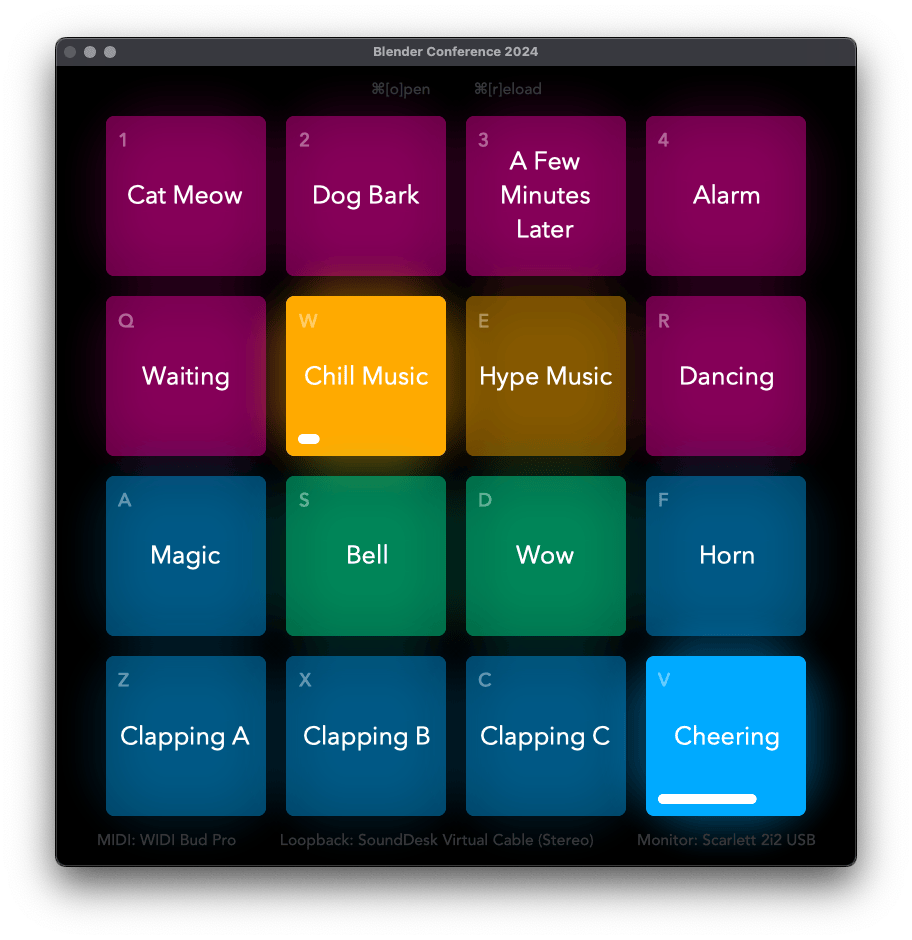
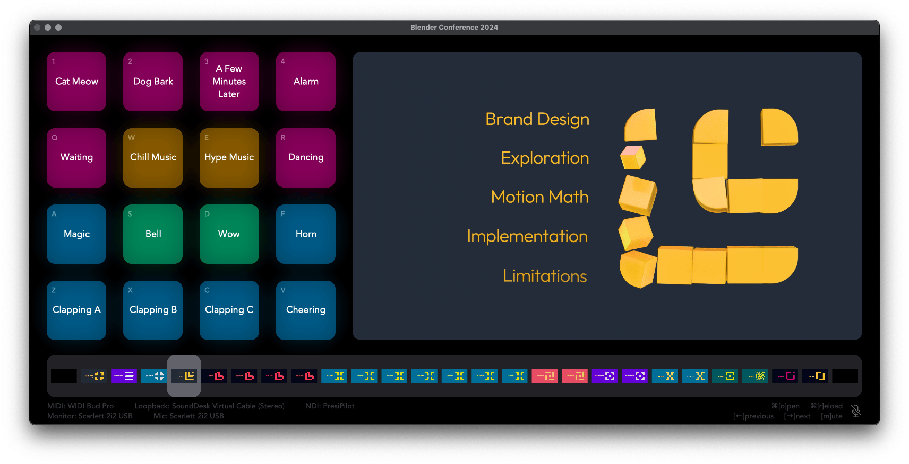
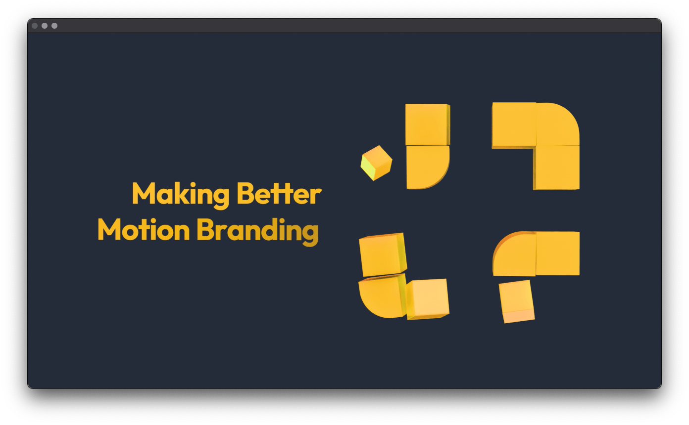

# Vuo Presentation Tools
Tools for presentations and live events using a simple directory of movies, images, and audio files.

## Installation

- Customise and export MacOS apps using [Vuo Pro](https://vuo.org)
  - **PresiPatch** provides a soundboard for podcasts and other live audio events
  - **PresiPilot** is an all-in-one media and audio presentation system for use with [NDI tools](https://ndi.video/tools/) (combines patch, play, and presentation timeline overview with unified A/V output)
  - **PresiPlay** presents a folder of movies and images in a window for screen sharing
- For **PresiPatch** and **PresiPilot** soundboards, [SoundDesk Virtual Drivers](https://www.loudlab-app.com/sounddesk-vd) must be installed
  - The Vuo projects can also be customised to use other audio loopback systems such as BlackHole or VB-Cable, but it requires editing both the project and related modules
- For additional **PresiPilot** features such as virtual webcam usage in Slack, Teams, Zoom, OBS, and other streaming tools, please install [NDI Tools](https://ndi.video/tools/)

## PresiPatch 

Generates a 4x4 sound board from a folder of media files with mouse, keyboard, and MIDI note controls. This is a sub-set of the features found in PresiPilot, designed for independent use with other systems such as OBS streaming or podcasting platforms.

- On startup, choose a directory of audio files to use as soundboard

  - Press command+O to open a different directory
  - If fewer than 16 files are found, the last one will be repeated to fill the 4x4 grid
  - If more than 16 files are found, only the first 16 will be used
  - The grid is filled from left to right, bottom to top (follows MIDI sound board conventions)
  - A plain text "Config.csv" file in this directory defines MIDI settings (see below)

- Audio file naming convention "Sort-Name-Fadeout-Colour.ext"

  - Sort: while any alphanumeric ID schema can be used, numbers are easiest (if there are files starting with "01-" and "02-", a file starting with "03-" will be the third patch in the bottom row)
  - Name: can include anything except dashes (these are used to separate the four parts of the file name)
  - Fadeout: should only include digits and defines the audio clip fadeout duration in seconds (if an audio track is clicked or triggered a second time during playback, it'll fade using this duration, allowing for easy interruption of a track without a sudden stop)
  - Colour: hash mark followed by six hexadecimal characters (0-9, a-f) that sets the colour of the button displayed in the window (does not communicate with MIDI controllers, so matched colour schemes will have to be set up separately for the specific 4x4 controller being used)
  - For example: "03-Dog Barking-1-#ff00aa.wav"

- Keyboard shortcuts:

  - `⌘O` opens a new directory
  - `⌘R` reloads the directory and resets the presentation to the first media item in the list
  - Keyboard shortcuts for the patches themselves are defined in the Vuo projects and sub-modules, and are labeled in the upper left corner of each patch, using the closest thing we have to a 4x4 grid on most common keyboards:

  | 1    | 2    | 3    | 4    |
  | ---- | ---- | ---- | ---- |
  | Q    | W    | E    | R    |
  | A    | S    | D    | F    |
  | Z    | X    | C    | V    |

- MIDI input will default to the first device found (wired, wireless, or software), and input definitions rely on "Config.csv"

  - File should contain comma separated rows with audio patch number, channel number, and note number
  - Audio samples must be number 1-16, with only exact matches found

  | Soundboard | Channel | Note |
  | ---------- | ------- | ---- |
  | patch1     | 10      | 36   |
  | patch2     | 10      | 37   |
  | patch3     | 10      | 38   |
  | ...        |         |      |

  - The provided sample configuration file is set up for use with the [M-Vave SMC-Pad](http://www.m-vave.com/cpjs) MIDI controller; it's not a great drum pad, it's just cheap (listed on Amazon for double the price you can find elsewhere, buyer beware)

- Direct mouse clicks are supported but *slightly* laggy in the UI (keyboard and MIDI inputs can feel a little faster)

- Audio patches are played through both the local audio of the MacOS machine (uses the system audio output setting) and the virtual driver, which can be used in other apps as needed (such as OBS with an audio input set to the same virtual driver)

  - Depending on Vuo or system performance, they may be some lag in the virtual driver output to other applications

## PresiPilot 

Creates a presentation streaming console from a directory of media files with mouse, keyboard, and MIDI controls, displaying a full 4x4 sound board (right), NDI stream preview (left), and presentation thumbnails (bottom). This is a combination and expansion of the features found in **PresiPilot** and **PresiPlay** designed for presenting through NDI Virtual Input as a webcam in conferencing software or other NDI based media streaming systems such as OBS.

- On startup, choose a directory of videos, images, and audio files
  - Video and image files will be sorted alphanumerically to generate the presentation sequence and populate the timeline thumbnails along the bottom (relies on Vuo sort algorithm)
  - The first image or video will automatically begin streaming in the preview area on the right side of the window and to the PresPilot NDI video feed (accessible to other NDI apps such as Virtual Input or OBS using the NDI plugin, along with other computers on the local network)
  - Audio files in the directory and any sub-directories (making it easier to organise) will be used to populate the 4x4 sound board on the left side of the window
- File naming:
  - Videos with `-loop` in the file name (case insensitive) will play on repeat until a previous or next action is manually triggered
  - Videos with `-next` in the file name (case insensitive) will automatically automatically trigger a next action when playback reaches the end of the video
  - Images do not have any special naming characteristics, outside of needing to start with the same sequential system as other media files
  - Audio files use the same naming convention as defined in PresiPatch (see above)
- Settings are loaded from the "Config.csv" file in the selected directory
  - Video playback settings when navigating backwards through the file list uses the same `previousplay=true` as detailed in the **PresiPlay** settings below
- When a directory is opened, a "Cache" folder is automatically generated with thumbnails for all of the media elements (videos and images) for more efficient display
  - This is not currently regenerated when media changes, and thumbnails are not removed if source files are deleted...manual management will be necessary
  - Depending on the number and size of the media files, there can be a noticeable wait before the thumbnails appear and the interface updates! This process is spun off into another thread, so it shouldn't block anything, but it can make things look broken till the thumbnails are generated for the first time
- Keyboard shortcuts:
  - `⌘O` opens a new directory
  - `⌘R` reloads the directory and resets the presentation to the first media item in the list
  - `M` toggles microphone mute (the default system audio input is passed through the virtual driver loopback and sent through the NDI video feed but *not* the default audio output)
  - `←` navigates to the previous video in the list
  - `→` navigates to the next video in the list (when starting a presentation, this plays the first video)
- The 4x4 sound board uses the same keyboard + MIDI + mouse setup and controls as listed above in **PresiPatch** with the virtual driver output of the sound patches used as the input for the NDI video stream
  - Depending on Vuo or system performance, they may be some lag in the audio that's output to the NDI media stream
- The media streaming output uses the same keyboard + MIDI setup and controls as listed below in **PresiPlay** with the notable addition of mouse controls for the thumbnails displayed along the bottom
  - You can jump to any point in the presentation by clicking on one of the the thumbnails displayed along the bottom of the window
  - Supported MIDI actions (must include either "1" or "2" at the end, only exact matches are found):
    - `prev`
    - `next`
    - `stop` (pauses current video)
    - `reset` (reloads directory and resets presentation to the first media item)
- Media (video/image and audio outputs) is streamed to a public NDI source named "PresiPilot"
  - To use this as a source in OBS, please install the NDI plugin and choose "PresiPilot" as the input
  - To use this as a virtual webcam in a conferencing system like Slack, Teams, or Zoom, please install [NDI Tools](https://ndi.video/tools/), open the "NDI Virtual Input" application, and choose "PresiPilot" from the list of available sources, then choose "NDI "
  - Depending on Vuo or system performance, they may be some lag between what is seen in the PresiPilot window and the NDI receiver

## PresiPlay 

Creates a presentation view for a folder of media files with mouse, keyboard, and MIDI controls. This is a sub-set of the features found in PresiPilot, designed for use with screen sharing and fullscreen presentation modes.

- On startup, choose a directory of videos and/or images

  - Media files will be sorted alphanumerically to generate the presentation sequence (relies on Vuo sort algorithm)
  - The first image or video will automatically begin playing in the window, regardless of fullscreen status

- File naming:

  - Videos with `-loop` in the file name (case insensitive) will play on repeat until a previous or next action is manually triggered
  - Videos with `-next` in the file name (case insensitive) will automatically automatically trigger a next action when playback reaches the end of the video
  - Images do not have any special naming characteristics, outside of needing to start with the same sequential system as other media files to ensure proper sorting

- Settings are loaded from the "Config.csv" file in the selected directory

  - When moving backwards through a presentation, you can choose if movies should automatically play or not
    - `playprevious=true` means videos will always play from the start of the video, regardless of the direction you're currently navigating through the presentation
    - `playprevious=false` (or no definition at all) means videos will load the *final frame* instead of playing from the start when navigating backwards through the presentation list
      - This is necessary for presentations where the videos are *transitions* between key visuals, such as used in the Blender Conference 2024 talk [Making Better Motion Branding](https://www.youtube.com/watch?v=BjCRQ9EFubQ) (where an early version of **PresiPlay** was first used)
  - MIDI settings are detailed separately below

- Keyboard shortcuts:

  - `⌘O` opens a new directory
  - `⌘R` reloads the directory and resets the presentation to the first media item in the list
  - `⌘F` toggles fullscreen
  - `←` navigates to the previous video in the list
  - `→` navigates to the next video in the list (when starting a presentation, this plays the first video)

- MIDI input will default to the first device found (wired, wireless, or software), and input definitions rely on "Config.csv" with support for up to two different controller inputs per action (appending "1" or "2" to the action abbreviation)

  - File should contain comma separated rows with command action, channel number, and controller number

  | Action | Channel | Controller |
  | ------ | ------- | ---------- |
  | prev1  | 1       | 25         |
  | prev2  | 1       | 61         |
  | next1  | 1       | 26         |
  | next2  | 1       | 62         |
  | stop1  | 1       | 28         |
  | ...    |         |            |

  - The provided sample configuration file is set up for use with both the [M-Vave SMC-Pad and SMC-Mixer](http://www.m-vave.com/cpjs) MIDI controllers, with the same caveats as above (these aren't recommendations, they're just affordable...and Amazon charges double the prices you can find elsewhere)
  - Supported MIDI actions (must include either "1" or "2" at the end, only exact matches are found):
    - `prev`
    - `next`
    - `stop` (pauses current video)
    - `reset` (reloads directory and resets presentation to the first media item)
  - Because triggering an open folder panel from MIDI can result in an event loop, that feature is not included (and you'd need to be operating the computer directly to interact with the open window anyway, opening it from a MIDI control wouldn't make much sense)

- Direct mouse clicks are *not* supported as there are no on-screen controls; this is designed exclusively for fullscreen and screen sharing setups (though outside of fullscreen mode the window title bar cannot be hidden by Vuo)
